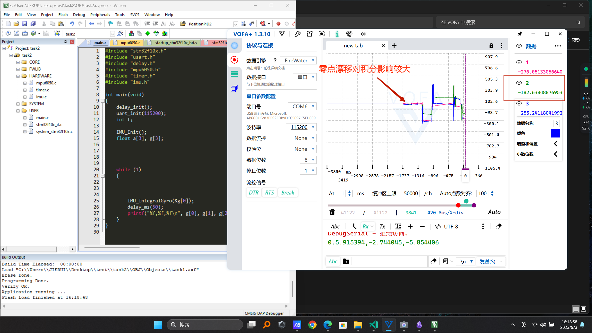

# View

工程采用MPU6050作为传感器，芯片为STM32F103ZET6

## task1

陀螺仪原始数据显示:

数据拨动较小

加速度计原始数据显示:

x轴垂直

y轴垂直

z轴垂直

## task2

roll轴旋转180度结果，积分数据误差较大

数据经过简单的均值滤波和陀螺仪去漂移处理，零点漂移仍然对积分结果有影响

## task3

初始值

pitch角

roll角

由于yaw角无磁力计校准，故该角数据无效

## task4&5见工程文件